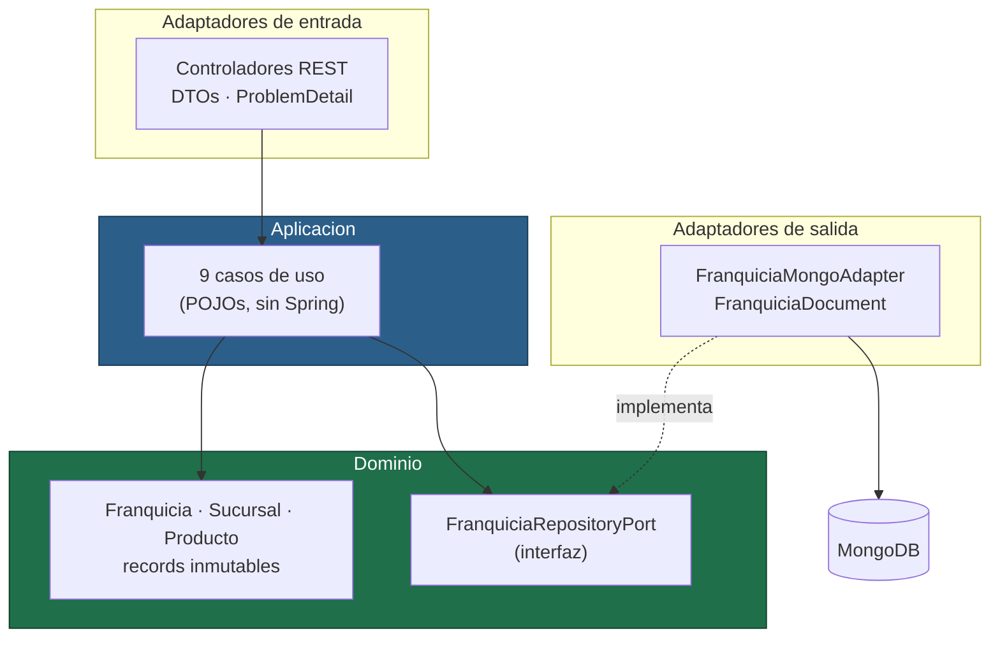
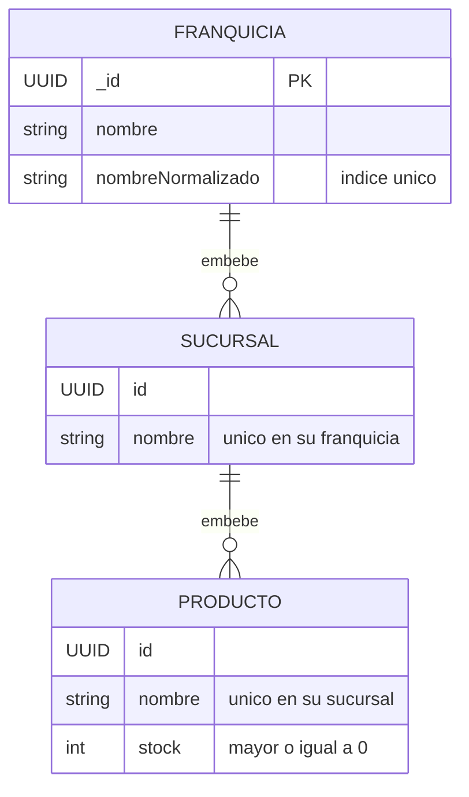

# API de Franquicias

API reactiva para gestionar franquicias, sus sucursales y los productos ofertados en
cada una. Prueba tecnica de desarrollador backend.

[](https://github.com/IbanezCamilo/franquicias-api/actions/workflows/ci.yml)

---

## Arranque rapido

Lo unico que hace falta es Docker:

```bash
git clone https://github.com/IbanezCamilo/franquicias-api.git
cd franquicias-api
docker compose up --build
```

Levanta la API y un MongoDB local. **No se necesitan credenciales de MongoDB Atlas
ni ninguna cuenta en la nube.** Cuando termine:

| Recurso | URL |
|---|---|
| Swagger UI | http://localhost:8080/swagger-ui.html |
| OpenAPI JSON | http://localhost:8080/v3/api-docs |
| Health check | http://localhost:8080/actuator/health |

Para apagarlo todo y borrar los datos: `docker compose down -v`.

---

## Stack

| Pieza | Eleccion | Motivo |
|---|---|---|
| Lenguaje | Java 21 (LTS) | |
| Framework | Spring Boot 4.1.1 con **WebFlux** | Reactivo de punta a punta, sin bloqueos |
| Persistencia | MongoDB Atlas M0 (driver reactivo) | [ADR 0003](docs/adr/0003-mongodb-atlas-y-render.md) |
| Arquitectura | Hexagonal (puertos y adaptadores) | [ADR 0001](docs/adr/0001-arquitectura-hexagonal.md) |
| Documentacion | springdoc-openapi 3.1.1 | Swagger UI navegable |
| Errores | `ProblemDetail` (RFC 9457) | Formato estandar de errores HTTP |
| Build | Maven (con wrapper) | No hay que instalar Maven |
| IaC | Terraform (provider MongoDB Atlas) | |

---

## Endpoints

Base: `/api/v1`

| Metodo | Ruta | Que hace | Exito | Errores |
|---|---|---|---|---|
| `POST` | `/franquicias` | Agrega una franquicia | 201 | 400, 409 |
| `POST` | `/franquicias/{fid}/sucursales` | Agrega una sucursal | 201 | 400, 404, 409 |
| `POST` | `/franquicias/{fid}/sucursales/{sid}/productos` | Agrega un producto | 201 | 400, 404, 409 |
| `DELETE` | `/franquicias/{fid}/sucursales/{sid}/productos/{pid}` | Elimina un producto | 204 | 404 |
| `PATCH` | `/franquicias/{fid}/sucursales/{sid}/productos/{pid}/stock` | Modifica el stock | 200 | 400, 404 |
| `GET` | `/franquicias/{fid}/sucursales/productos-top-stock` | **Producto con mayor stock por sucursal** | 200 | 404 |
| `PATCH` | `/franquicias/{fid}/nombre` | Renombra la franquicia | 200 | 400, 404, 409 |
| `PATCH` | `/franquicias/{fid}/sucursales/{sid}/nombre` | Renombra la sucursal | 200 | 400, 404, 409 |
| `PATCH` | `/franquicias/{fid}/sucursales/{sid}/productos/{pid}/nombre` | Renombra el producto | 200 | 400, 404, 409 |

### El reporte de mayor stock

Es el criterio de aceptacion mas interesante, y el enunciado deja tres cosas sin
precisar. Asi se resolvieron:

- **Uno por sucursal.** Devuelve el producto de mayor stock de *cada* sucursal de la
  franquicia, no el top global, e incluye a que sucursal pertenece.
- **Las sucursales sin productos se omiten.** Si no hay catalogo, no hay producto que
  destacar.
- **Los empates se resuelven por nombre ascendente**, para que la respuesta sea
  determinista y no dependa del orden de insercion.

```http
GET /api/v1/franquicias/{franquiciaId}/sucursales/productos-top-stock
```

```json
[
  {
    "sucursalId": "45bbf83e-df18-4baf-87be-2563c8e28a79",
    "sucursalNombre": "Sucursal Norte",
    "producto": { "id": "c71b9860-...", "nombre": "Te Verde", "stock": 80 }
  },
  {
    "sucursalId": "4f63070a-9288-42d6-ad00-43889f00d51a",
    "sucursalNombre": "Sucursal Sur",
    "producto": { "id": "914f3012-...", "nombre": "Aguacate", "stock": 50 }
  }
]
```

### Errores

Todos siguen la RFC 9457 y se sirven como `application/problem+json`:

```json
{
  "type": "/errores/validacion",
  "title": "Peticion invalida",
  "status": 400,
  "detail": "Uno o mas campos no superan la validacion",
  "instance": "/api/v1/franquicias/.../productos",
  "timestamp": "2026-10-02T22:49:12.311127153Z",
  "errors": { "stock": "El stock no puede ser negativo" }
}
```

| Codigo | Cuando |
|---|---|
| `400` | Nombre fuera de rango o en blanco, stock negativo, JSON ilegible, identificador que no es UUID |
| `404` | La franquicia, la sucursal o el producto no existen; tambien, ruta no mapeada |
| `409` | Nombre duplicado en su ambito |

---

## Reglas de negocio

No venian en el enunciado; se definieron de forma explicita y estan cubiertas por tests.

| Regla | Comportamiento |
|---|---|
| Formato de nombre | Se recortan los espacios de los extremos; entre 2 y 100 caracteres |
| Stock | Entero no negativo. **Cero es valido**: producto agotado, no inexistente |
| Unicidad de franquicia | Por nombre, en todo el sistema |
| Unicidad de sucursal | Por nombre, dentro de su franquicia |
| Unicidad de producto | Por nombre, dentro de su sucursal |
| Comparacion de nombres | Ignora mayusculas y espacios: `"Sucursal Norte"` y `" sucursal norte "` son el mismo nombre |
| Renombrar a si mismo | No se considera conflicto |
| Identidad | Es un UUID independiente del nombre, para que renombrar no rompa las referencias |

El vocabulario del dominio esta en [CONTEXT.md](CONTEXT.md).

---

## Arquitectura

Dependencias siempre hacia dentro: la infraestructura conoce al dominio, nunca al reves.



El dominio y la aplicacion **no importan nada de Spring ni de MongoDB**. Por eso el
grueso de los tests corre sin levantar contexto.

```
src/main/java/com/franquicias/api/
├── domain/              modelo, excepciones, validacion y puerto de salida
├── application/usecase/ un caso de uso por operacion
├── infrastructure/
│   ├── in/web/          controladores, DTOs y manejo de errores
│   └── out/mongo/       documento, repositorio y adaptador
└── config/              cableado de casos de uso y metadatos de OpenAPI
```

### Modelo de datos

Un unico documento por franquicia, con el arbol embebido ([ADR 0002](docs/adr/0002-modelo-embebido.md)):



`nombreNormalizado` existe solo para el indice unico: la unicidad del dominio ignora
mayusculas, y un indice sobre el nombre original seria sensible a ellas.

---

## Ejecucion en local

### Con Docker (recomendado)

```bash
docker compose up --build
```

### Sin Docker

Hace falta Java 21 y un MongoDB accesible. El wrapper descarga Maven solo.

```bash
# 1. Un Mongo cualquiera, por ejemplo:
docker run -d -p 27017:27017 --name mongo mongo:8.0

# 2. La aplicacion
./mvnw spring-boot:run          # Linux y macOS
mvnw.cmd spring-boot:run        # Windows
```

### Sin Docker y sin instalar Mongo

Hay un arranque que levanta un MongoDB efimero con Testcontainers (requiere Docker
igualmente, pero no configurar nada):

```bash
./mvnw spring-boot:test-run
```

### Variables de entorno

Copia `.env.example` como `.env` o exportalas directamente.

| Variable | Por defecto | Para que |
|---|---|---|
| `MONGODB_URI` | `mongodb://localhost:27017/franquicias` | Cadena de conexion |
| `PORT` | `8080` | Puerto HTTP. Render lo inyecta automaticamente |

---

## Pruebas

```bash
./mvnw test      # 107 tests unitarios, sin Docker, segundos
./mvnw verify    # + 6 tests de integracion con Testcontainers (requiere Docker)
```

| Nivel | Cuantos | Que cubre |
|---|---|---|
| Dominio | 54 | Reglas de negocio e invariantes, sin Spring |
| Casos de uso | 27 | Orquestacion con `StepVerifier` y un repositorio en memoria |
| Slice web | 26 | `@WebFluxTest` + `WebTestClient`: codigos de estado, validacion y serializacion |
| Integracion | 6 | MongoDB real con Testcontainers, recorrido completo de punta a punta |

**113 en total.** La piramide es deliberada: las reglas se prueban donde son baratas de
probar, y la base de datos solo donde aporta informacion que un doble no puede dar.

### Coleccion de peticiones

En [`postman/`](postman/) hay una coleccion lista para importar en Postman o Bruno, con
los nueve endpoints encadenados: los identificadores se guardan solos entre peticiones,
asi que se puede ejecutar de arriba abajo sin copiar y pegar nada. Incluye ademas tres
peticiones de error (409, 400 y 404) y aserciones automaticas.

Se puede ejecutar sin abrir Postman:

```bash
docker compose up -d --build
npx newman run postman/franquicias-api.postman_collection.json
```

---

## Despliegue en la nube

### Infraestructura con Terraform

`terraform/` aprovisiona en MongoDB Atlas el proyecto, el cluster M0 gratuito, el
usuario de base de datos y la lista de IP permitidas.

```bash
cd terraform
cp terraform.tfvars.example terraform.tfvars   # rellenar con las credenciales
terraform init
terraform plan
terraform apply
terraform output -raw mongodb_uri              # la MONGODB_URI para el runtime
```

Las claves de la API se crean en Atlas, en **Organization → Access Manager → API Keys**,
con el rol `Organization Project Creator`. Ni `terraform.tfvars` ni el estado se
versionan.

### Aplicacion en Render

`render.yaml` describe el servicio: runtime Docker, plan gratuito, health check en
`/actuator/health` y redespliegue automatico en cada push a `main`. La unica variable
que hay que configurar a mano es `MONGODB_URI`, porque lleva credenciales.

---

## Limitaciones conocidas

Se documentan en lugar de disimularse.

**El plan gratuito de Render duerme el servicio.** Tras 15 minutos sin trafico, el
contenedor se detiene. El primer request posterior puede tardar del orden de un minuto
mientras arrancan contenedor y JVM; los siguientes responden con normalidad. Si la
primera llamada parece colgada, es esto.

**La lista de acceso de Atlas esta abierta a `0.0.0.0/0`.** Render free no asigna IP de
salida estatica, asi que no hay un rango concreto que autorizar. Lo que protege es el
usuario de base de datos, limitado a `readWrite` sobre una unica base, y TLS, que Atlas
impone siempre. En produccion la solucion correcta es VPC peering o PrivateLink, que
Atlas ofrece desde el nivel M10 de pago.

**No hay bloqueo optimista.** Dos escrituras concurrentes sobre la *misma* franquicia
pueden provocar una actualizacion perdida. Se explica en detalle, con la solucion, en el
[ADR 0002](docs/adr/0002-modelo-embebido.md). La unicidad del nombre de franquicia si
esta protegida frente a concurrencia, mediante un indice unico.

**La API no tiene autenticacion.** El enunciado no la pedia y anadirla sin un modelo de
usuarios definido habria sido inventar requisitos.

---

## Decisiones de diseno

Las tres decisiones dificiles de revertir estan registradas:

- [ADR 0001 — Arquitectura hexagonal con dominio libre de framework](docs/adr/0001-arquitectura-hexagonal.md)
- [ADR 0002 — Un unico documento por franquicia, con el arbol embebido](docs/adr/0002-modelo-embebido.md)
- [ADR 0003 — MongoDB Atlas sobre DynamoDB o PostgreSQL, y Render como runtime](docs/adr/0003-mongodb-atlas-y-render.md)

---

## Criterios de aceptacion

| # | Criterio | Estado |
|---|---|---|
| 1 | Desarrollado en Spring Boot | Spring Boot 4.1.1 |
| 2 | Endpoint para agregar franquicia | `POST /franquicias` |
| 3 | Endpoint para agregar sucursal | `POST /franquicias/{fid}/sucursales` |
| 4 | Endpoint para agregar producto | `POST .../sucursales/{sid}/productos` |
| 5 | Endpoint para eliminar producto | `DELETE .../productos/{pid}` |
| 6 | Endpoint para modificar stock | `PATCH .../productos/{pid}/stock` |
| 7 | Producto con mayor stock por sucursal | `GET .../sucursales/productos-top-stock` |
| 8 | Persistencia en la nube | MongoDB Atlas M0 |

### Puntos extra

| Extra | Estado |
|---|---|
| Empaquetado con Docker | `Dockerfile` multi-stage y `docker-compose.yml` |
| Programacion funcional y reactiva | WebFlux de punta a punta, dominio inmutable |
| Actualizar nombre de franquicia | `PATCH /franquicias/{fid}/nombre` |
| Actualizar nombre de sucursal | `PATCH .../sucursales/{sid}/nombre` |
| Actualizar nombre de producto | `PATCH .../productos/{pid}/nombre` |
| Persistencia como infraestructura como codigo | Terraform para MongoDB Atlas |
| Solucion desplegada en la nube | Render, desde el `Dockerfile` |
